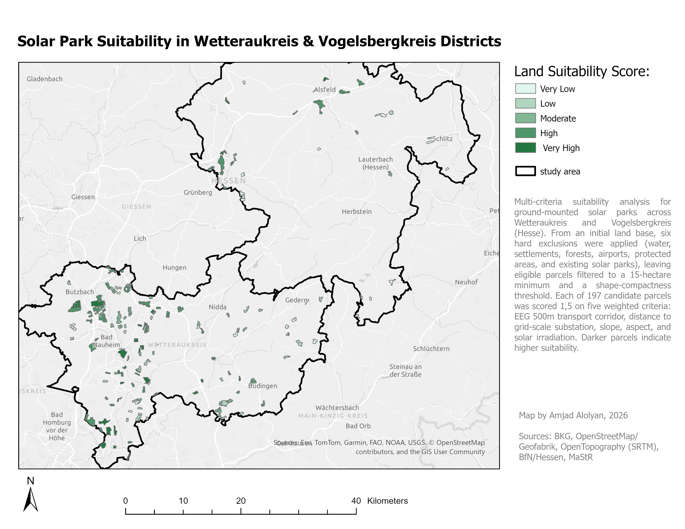
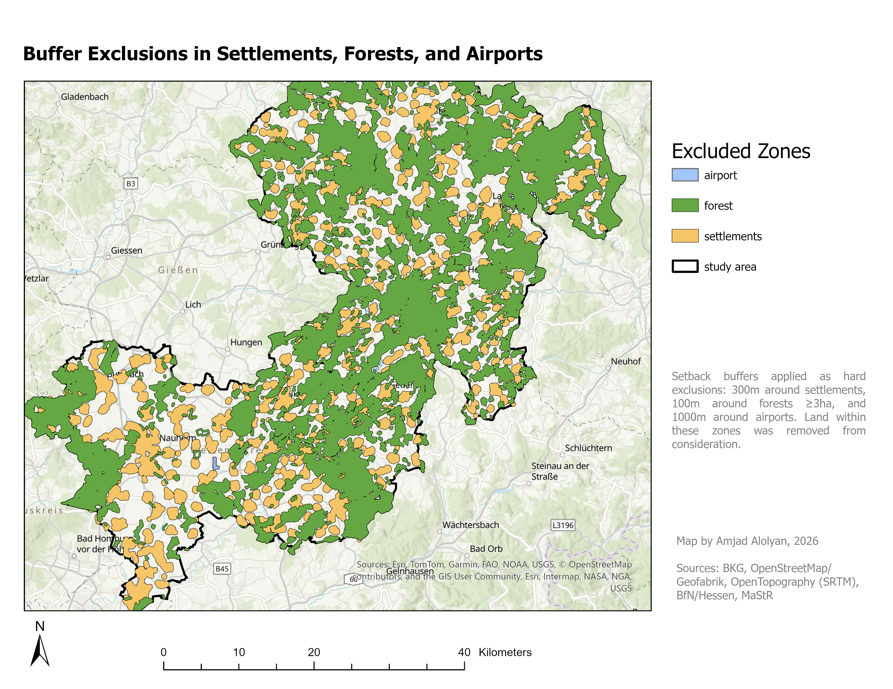
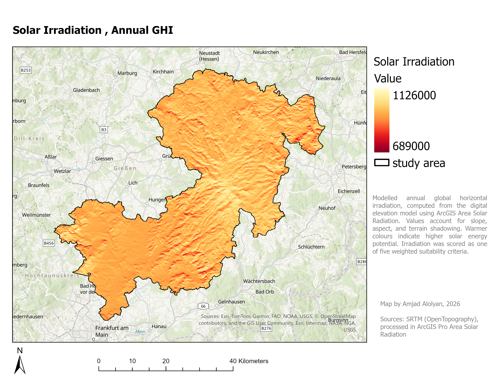

# Solar Park Suitability Analysis , Wetteraukreis & Vogelsbergkreis (Hesse)

A multi-criteria GIS analysis to find the best sites for ground-mounted solar parks (GMPV) across two contrasting districts in Hesse, Germany. One district is flat (Wetteraukreis), the other is hilly (Vogelsbergkreis), and that contrast is the point: it lets the model show where utility-scale solar actually makes sense, and why.

## What this project does

Starting from the full land area of both districts, I applied a series of hard exclusions (legal and physical no-go zones), filtered what was left down to realistic utility-scale parcels, and then scored each parcel from 1 to 5 on five weighted criteria. The result is a ranked set of 197 candidate sites, with the strongest sites concentrated in the flatter Wetteraukreis, close to grid infrastructure and inside the legally fundable corridor.

This was built as a portfolio project to practice a full real-world GIS workflow end to end: data sourcing, spatial preparation in ArcGIS Pro, scripted analysis in Python (GeoPandas / Shapely / STRtree), and cartographic output.

## Study area

Wetteraukreis and Vogelsbergkreis sit in central Hesse. I picked them deliberately for their contrast: Wetteraukreis is low and agricultural, Vogelsbergkreis is a hilly, heavily forested volcanic upland. A good suitability model should treat them very differently, and this one does, most viable sites land in the flat district, while the hilly one is mostly filtered out by slope, forest, and protected areas. That difference is a finding, not a flaw.

## Method

### 1. Hard exclusions

Land was removed in stages. Each exclusion is a place you legally cannot or practically should not build:

- Water bodies
- Settlements (300 m buffer)
- Forests of 3 ha or larger (100 m buffer)
- Airports (1000 m buffer)
- Protected areas (no buffer, hard legal block)
- Existing solar parks

Protected areas were treated as a hard exclusion and split into the three relevant designations: FFH (Fauna-Flora-Habitat) and SPA (Special Protection Areas), which together form the EU Natura 2000 network, plus NSG (Naturschutzgebiete), nationally designated nature reserves. Landscape protection areas and nature parks are softer designations, so I did not exclude them, just noted them.

The exclusion chain, in feature counts:

| Step | Parcels remaining |
|---|---|
| Usable land use (farmland, grass, meadow, scrub, farmyard) | 31,699 |
| After removing water | 31,693 |
| After settlements (300 m) | 22,666 |
| After forests (100 m, forests ≥3 ha) | 19,044 |
| After airports (1000 m) | 19,035 |
| After protected areas | 13,639 |
| After existing solar parks | 13,635 |

### 2. Building candidate parcels

The eligible land was a fragmented mess of small pieces, so I dissolved it and split it back into discrete patches (9,535 of them), then filtered:

- Minimum size of 15 hectares (utility-scale floor)
- A shape-compactness threshold to drop long thin slivers that clear the size cut but are unbuildable

That left **197 candidate parcels**.

### 3. Measuring the criteria

Each parcel was measured on five criteria. Terrain criteria came from a 30 m SRTM digital elevation model via zonal statistics; distance criteria were computed in Python using a spatial index (STRtree) for fast nearest-neighbour queries.

- **Slope** , flatter is cheaper and easier to build on. Scored in tiers (0,3° best).
- **Aspect (southness)** , raw compass aspect can't be averaged directly (north is both 0° and 360°), so I converted it to a "southness" value from -1 (north-facing) to +1 (south-facing or flat), which can be averaged correctly. South and flat score highest.

- **Solar irradiation (GHI)** , modelled annual global horizontal radiation using the ArcGIS Area Solar Radiation tool, which accounts for slope, aspect, and terrain shadowing across the year.
- **EEG 500 m corridor** , under the German EEG, ground-mounted solar is fundable along a 500 m corridor beside motorways and two-track railways (minus a 40 m Autobahn setback). I measured each parcel's distance into or out of that corridor.
- **Substation distance** , distance to the nearest grid-scale substation, a proxy for grid-connection cost. I filtered the raw OSM substations to higher-voltage ones, since a utility park can't connect into a small village transformer.

### 4. Scoring and weights

Each criterion was scored 1,5, multiplied by a weight, and summed. The weights are a starting set based on what matters most for siting (grid access and legal eligibility dominate), normalised to 100%:

| Criterion | Weight |
|---|---|
| EEG 500 m corridor | 27.2% |
| Substation distance | 27.2% |
| Slope | 16.3% |
| Aspect (southness) | 16.3% |
| Solar irradiation (GHI) | 13.0% |

Final scores ranged from 1.71 to 4.59. The top-scoring parcels are all inside the EEG corridor, close to a substation, and flat, exactly what the weighting should produce.

## Key findings

- **197 buildable candidate parcels** across both districts.
- **78 of 197 parcels (about 40%) fall inside the EEG transport corridor**, so they are fundable without relying on the disadvantaged-areas route.
- **The flat district dominates.** Most high-scoring sites are in Wetteraukreis. Vogelsbergkreis is largely filtered out by slope, forest, and protected areas, which matches where developers actually build.
- **GHI is a weak discriminator here.** Across mostly flat parcels, solar irradiation barely varies, so grid access and legal eligibility matter far more than small differences in sunlight. That is why GHI carries the lowest weight.

## Tools

- **ArcGIS Pro** , spatial preparation, exclusions, zonal statistics, solar radiation modelling, cartography
- **Python** , GeoPandas, Shapely, STRtree for the distance criteria and scoring
- **Data formats** , GeoPackage, File Geodatabase, GeoTIFF

## Data sources

| Data | Source |
|---|---|
| Administrative boundaries | BKG (Bundesamt für Kartographie und Geodäsie), VG250 |
| Land use & infrastructure | OpenStreetMap, via Geofabrik (Hesse extract) |
| Elevation (DEM) | SRTM GL1 30 m, OpenTopography |
| Protected areas | BfN / Land Hessen (FFH, SPA, NSG via Hessen INSPIRE services) |
| Existing solar parks | Marktstammdatenregister (MaStR), Bundesnetzagentur |
| Basemap | Esri World Topographic Map |

## Limitations and notes

A few honest caveats, because they matter for how the results should be read:

- **OSM instead of ATKIS.** Professional siting studies in Germany usually use ATKIS land-use data. I used OpenStreetMap for accessibility and reproducibility, which is good enough to demonstrate the method but less authoritative.
- **Substation voltage tags are patchy.** Only about 100 of the 4,000+ OSM substations carried a voltage tag, so the grid-scale filter keeps the tagged higher-voltage ones and drops the rest. The dropped ones are almost all small village transformers I'd exclude anyway, but it's a data-quality caveat.
- **GHI at 90 m.** Solar radiation was modelled at a coarsened 90 m resolution to keep run times reasonable. Fine for parcel averages, not for detailed shadow analysis.
- **Existing solar parks as points.** MaStR gives a point per park, not a footprint, so for the exclusion I buffered each point into a circle sized to its registered capacity (about 1 MW per hectare). They are mainly useful here for validation.
- **Weights are a starting set.** They reflect siting priorities but were not yet derived through a formal Analytic Hierarchy Process (AHP). AHP-based weighting is a planned refinement.

## Scripts

| Script | What it does |
|---|---|
| `build_existing_solar.py` | Turns the MaStR CSV exports into a clean point layer of existing solar parks |
| `buffer_existing_solar.py` | Buffers those points into capacity-sized footprints for the exclusion |
| `distances.py` | Computes substation distance and EEG corridor distance per parcel (STRtree) |
| `refine_substations.py` | Filters substations to grid-scale by voltage and recomputes distances |
| `score_parcels.py` | Scores each parcel 1,5 on all five criteria, applies weights, ranks them |

---

*Built by Amjad Alolyan, 2026. Part of a GIS / sustainable urban development portfolio.*
